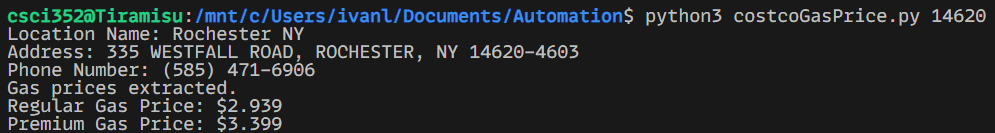

# Costco Gas Price Finder

This script automates the process of finding the nearest Costco gas center and retrieving gas prices using Selenium WebDriver.



## Prerequisites

Before running the script, ensure you have the following installed:

- Python 3.x
- Google Chrome browser
- ChromeDriver (compatible with your version of Chrome)
- Selenium package

## Installation

1. **Clone the Repository**: 
   ```bash
   git clone <repository-url>
   cd <repository-directory>
   ```

2. **Install Required Python Packages**:
   Use pip to install the necessary packages:
   ```bash
   pip install selenium
   ```

## Usage

To run the script, use the following command:
```
python costcoGasPrice.py <zipCode>
```
